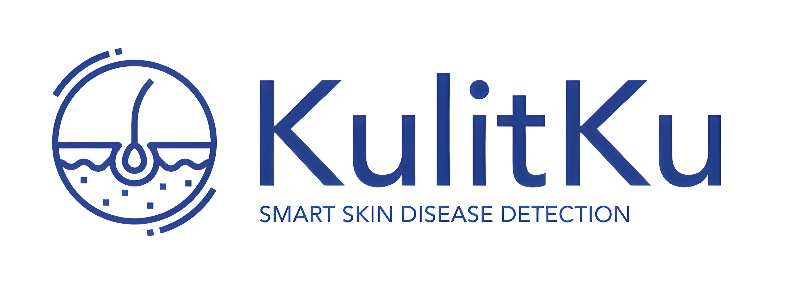

# KulitKu - Smart Application for Skin Disease Detection
*We are here to ensure your skin condition!*

## Team ID: C241-PS292
**Team Member :**
| Name                            | Bangkit-ID    | Path               | University                                           |
| -------------                   | ------------- | -------------      | -------------                                        |
| Muhammad Sutan Siregar                    | M008D4KY2762   | Machine Learning   | Universitas Gadjah Mada                            |
| Muhammad Reza Ubaidillah                | M269D4KY2834   | Machine Learning   | Universitas Mulawarman                      |
| Charles           | M004D4KY3046   | Machine Learning   | Institut Teknologi Sepuluh Nopember  |
| Arfi Raushani Fikra              | C004D4KY0721   | Cloud Computing | Institut Teknologi Sepuluh Nopember  |
| Rafi Aliefian Putra Ramadhani           | C004D4KY1225   | Cloud Computing | Institut Teknologi Sepuluh Nopember                  |
| Andrian Rajab Harahap                 | A207D4KY3489   | Mobile Development    | Universitas Harapan Medan                                    |
| M. Ridho Pangestu   | A207D4KY3538   | Mobile Development    | Universitas Harapan Medan                        |

## Project Overview
**KulitKu** is a mobile application designed to help users identify various skin conditions through taking and uploading images. The app leverages advanced ML algorithms to provide accurate results and detailed analysis, helping users understand the type and severity of their skin ailments. With a user-centered design, **KulitKu** offers a proactive solution to raise awareness about skin conditions, educate users about potential causes and long-term impacts, and empower them with valuable information for better health management.

## Project Scope Coverage
**Mobile App Development :**
- Application Flow Integration via Mobile Display
- Disease Scan
- User Account Management

**Cloud Computing Infrastructure**
- Scalable and Stable Infrastructure Environment
- Server-Side Components for Account Management, Data Storage, and Data Services

**Machine Learning Integration**
- Classification of various diseases using Convolutional Neural Networks (CNN) Using Transfer Learning on the MobileNetV3 Model

## Tools / IDE / Library / Platform:
### Tools
- **Figma**: UI/UX design collaboration
- **Laragon**: Database schema integration tool with local backend services

### Integrated Development Environment (IDE)
- **Android Studio**: Official IDE for Android development
- **Visual Studio Code**: IDE for creating API Services
- **Google Collab / Jupyter Notebook**: Collaborative ML Project environment

### Libraries
- **Numpy**: Fundamental package for scientific computing with Python. It provides support for arrays and matrices, along with a large collection of mathematical functions to operate on these arrays.
- **Pandas** : Data manipulation and analysis library, providing data structures like DataFrame and Series for handling tabular and time-series data.
- **TensorFlow** : Particularly used for building and training deep learning models.
- **Sklearn** : Data mining and data analysis. It supports various supervised and unsupervised learning algorithms.

### Platform
- **GitHub**: Version control and collaborative development
- **Postman**: API testing and development
- **Google Cloud Platform**: Cloud Service provider (Cloud Run, Cloud SQL, and Cloud Storage)

## App Features

Some of the features we've introduced so far include:

- Authentication System
- Random Facts Skin News
- Related Article
- Disease Scan History
- Classification of Various Diseases

## Installation or Getting Started Instructions First Experience

[FREE] For your first experience with the application, please click the Google Drive link below to download the application:

[ -- Link KulitKu Web App -- ]

 

***Thank you, please wait a moment, the application is under development!***
